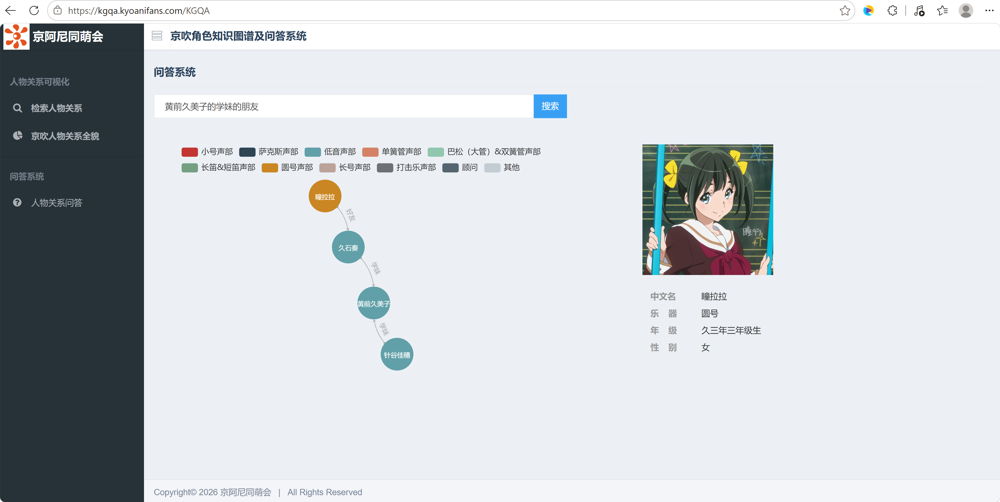

# 项目说明：基于 LTP v4.2.14 与 Neo4j 的《吹响！上低音号》人物关系知识图谱系统

## 📦 项目简介
本项目是在开源项目 **[chizhu/KGQA_HLM](https://github.com/chizhu/KGQA_HLM)**（基于知识图谱的《红楼梦》人物关系可视化及问答系统）的基础上进行改造与数据迁移的成果。

原项目主要面向古典文学《红楼梦》，而本次改造将其核心架构应用于动漫作品 **《吹响！上低音号》**（Hibike! Euphonium，粉丝常称“京吹”）。通过重新构建知识图谱、引入 **LTP v4.2.14** 自然语言处理模型及自定义词典机制，并整合了绝大多数角色的详细关系与角色介绍，成功实现了一个针对“京吹”粉丝的交互式人物关系可视化及智能问答系统。

## 🌐 在线演示
- **系统首页**（人物关系检索 / 关系全貌图）：[kgqa.kyoanifans.com](https://kgqa.kyoanifans.com)
- **人物关系问答**（可试试多跳问句“黄前久美子的学妹的朋友”）：[kgqa.kyoanifans.com/KGQA](https://kgqa.kyoanifans.com/KGQA)

## 🚀 核心改造内容

### 1. 数据源重构
- **原项目**：基于《红楼梦》文本挖掘或预设关系构建图谱。
- **本项目**：
    - 汇总了《吹响！上低音号》中绝大多数人物（包括北宇治高中吹奏乐部、其他学校及关联角色）的复杂人际关系。
    - 构建了包含 **10+ 种声部分类**（如小号、萨克斯、低音等）、**多种关系类型**（好友、学姐学妹、暗恋对象、青梅竹马、老师/顾问等）的结构化数据文件 `relation.txt`。
    - 引入了 **LTP (v4.2.14)** 自然语言处理模型，支持通过自定义词典（`custom_dict.txt`）精准识别角色名及特殊关系词（如“姬友”、“大号君同盟”），解决了传统图谱问答中实体提取不准的问题。

### 2. 功能说明
- **多跳推理能力**：系统不仅支持直接查询"A是谁"，还支持复杂的多层关系推理，例如：“黄前久美子的姬友的学姐是谁？”（自动拆解为 `A -> 姬友 -> B` 和 `B -> 学姐 -> C`）。
- **可视化交互**：保留了原项目的 ECharts 关系图展示能力，支持动态加载角色头像（Base64 编码），提供直观的人物网络视图。
- **智能问答 (KGQA)**：结合 NLP 分词与图谱查询，实现了自然语言到 Cypher 语句的动态转换，用户可直接输入句子获取答案。

> **多跳问答演示**：输入“黄前久美子的学妹的朋友”，系统自动拆解为两跳查询（`学妹 → 朋友`），返回完整关系链与角色信息卡：



### 3. 技术栈优化
- **后端**：Flask + Neo4j (图数据库) + LTP v4.2.14 (NLP)。
- **前端**：HTML/JS + ECharts（支持动态渲染关系网络）。
- **数据格式**：采用 CSV/Text 格式的 `relation.txt` 便于扩展和维护。

## 📂 项目结构概览
```text
hibike-euphonium-KGQA/
├── app.py                      # Flask 主入口：路由定义与页面渲染
├── requirements.txt            # 依赖清单（Flask / py2neo / ltp==4.2.14 等）
├── 多跳示例.png                 # 多跳问答演示截图
├── KGQA/                       # 问答系统模块
│   └── ltp_processor.py        # LTP 分词与实体提取（自定义词典 + 长词优先子串过滤）
├── neo_db/                     # 知识图谱存储模块
│   ├── config.py               # Neo4j 连接配置、声部分类映射、关系同义词表
│   ├── creat_graph.py          # 建图脚本：读取 relation.txt 导入 Neo4j
│   └── query_graph.py          # 关系检索、多跳问答核心、ECharts 数据序列化
├── raw_data/                   # 数据源
│   ├── relation.txt            # 人物关系三元组（128 角色 / 311 条关系）
│   └── full.py                 # 双向互补存储生成脚本（性别感知的反向关系映射）
├── spider/                     # 数据采集模块
│   ├── get_character_array.py  # 从 relation.txt 提取角色名单
│   ├── get_hlm_character.py    # 角色资料爬虫（百度百科：属性与头像）
│   ├── show_profile.py         # 人物卡数据读取
│   ├── images/                 # 角色头像资源
│   └── json/data.json          # 角色属性数据（中文名 / 乐器 / 年级 / 性别）
├── templates/                  # 前端页面（index / search / KGQA / all_relation）
└── static/                     # 静态资源与关系全貌图数据（data.json）
```

## 🎯 适用场景
- **粉丝社区**：快速查询角色间的复杂关系链（如“谁暗恋了 XX？”、“XX 的所有学姐是谁”）。
- **数据分析**：可视化展示北宇治高中吹奏乐部的组织架构与人际网络。
- **二次开发**：基于 `KGQA_HLM` 的成熟架构，可轻松替换为其他动漫、小说或游戏的人物关系系统。

## 📄 快速开始
1. **环境准备**：安装 Python 依赖库 `pip install -r requirements.txt`（Flask, py2neo, ltp==4.2.14 等）。
2. **数据导入**：在 `neo_db` 目录下运行 `python creat_graph.py`，将 `relation.txt` 加载至 Neo4j。
3. **启动服务**：运行 `python app.py` 并在浏览器访问 `http://localhost:5000`。

---
*特别感谢原项目作者 chizhu 提供的优秀架构基础，以及所有参与《吹响！上低音号》数据整理的贡献者。*

## 📚 资源与参考
- **LTP 官方下载**：哈工大社会计算与信息检索研究中心研发的语言技术平台（Language Technology Platform | LTP），[https://ltp.ai/index.html](https://ltp.ai/index.html)
